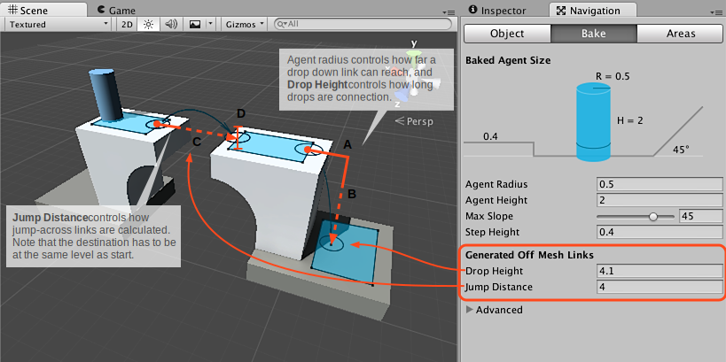

# Building Off-Mesh Links Automatically

Some use cases for Off-Mesh Links can be detected automatically. The two most common ones are: _Drop-Down_ and _Jump-Across_.

- **Drop-Down** links are created to drop down from a platform.
- **Jump-Across** links are created to jump across a crevice.

In order to find the jump locations automatically, the build process walks along the edges of the [**NavMesh**][1] and checks if the landing location of the jump is on NavMesh. If the jump trajectory is unobstructed an Off-Mesh link is created.

Let’s set up automatic Off-Mesh Link generation. If you’re not familiar with NavMesh baking, take a look at [Building a NavMesh](./BuildingNavMesh.md).

First, the objects in the [**Scene**][2] where the jump can _start from_ needs to be marked. This is done my checking **Generate Off-Mesh Links** option in the _Navigation Window_ under _Objects_ tab.

The second step is to setup the drop-down and jump-across trajectories:

- **Drop-Down** link generation is controlled by the Drop Height parameter. The parameter controls what is the highest drop that will be connected, setting the value to 0 will disable the generation.
    - The trajectory of the drop-down link is defined so that the horizontal travel **(A)** is: _2\*agentRadius + 4\*voxelSize_. That is, the drop will land just beyond the edge of the platform. In addition the vertical travel **(B)** needs to be more than bake settings’ _Step Height_ (otherwise we could just step down) and less than _Drop Height_. The adjustment by [**voxel**][3] size is done so that any round off errors during voxelization does not prevent the links being generated. You should set the _Drop Height_ to a bit larger value than what you measure in your level, so that the links will connect properly.
- **Jump-Across** link generation is controlled by the _Jump Distance_ parameter. The parameter controls what is the furthest distance that will be connected. Setting the value to 0 will disable the generation.
    - The trajectory of the jump-across link is defined so that the horizontal travel **(C)** is more than _2\*agentRadius_ and less than Jump Distance. In addition the landing location **(D)** must not be further than voxelSize from the level of the start location.

Now that objects are marked, and settings adjusted, it’s time to press _Bake_ and you have will have automatically generated off-mesh links! When ever you change the scene and bake, the old links will be discarded and new links will be created based on the new scene.

## Troubleshooting

Things to keep in mind if Off-Mesh links are not generated at locations where you expect them to be:

- _Drop Height_ should a bit bigger than the actual distance measured in your level. This ensures that small deviations that happen during the NavMesh baking process will not prevent the link to be connected.
- _Jump Distance_ should be a bit longer than the actual distance measured in your level. The Jump Distance is measured from one location on a NavMesh to another location on the NavMesh, which means that you should add _2\*agentRadius_ (plus a little) to make sure the crevices are crossed.

### Additional resources

- [Creating Off-Mesh Links](./CreateOffMeshLink.md) - learn how to manually create Off-Mesh Links.
- [Building a NavMesh](./BuildingNavMesh.md) – workflow for NavMesh baking.
- [Bake Settings](./NavAdvancedSettings.md) – full description of the NavMesh bake settings.
- [Off-Mesh Link component reference](https://docs.unity3d.com/Manual/class-OffMeshLink.html) – full description of all the Off-Mesh Link properties.
- [Off-Mesh Link scripting reference](https://docs.unity3d.com/ScriptReference/AI.OffMeshLink.html) - full description of the Off-Mesh Link scripting API.

[1]: ./BuildingNavMesh.md "A mesh that Unity generates to approximate the walkable areas and obstacles in your environment for path finding and AI-controlled navigation."
[2]: https://docs.unity3d.com/Manual/CreatingScenes.html "A Scene contains the environments and menus of your game. Think of each unique Scene file as a unique level. In each Scene, you place your environments, obstacles, and decorations, essentially designing and building your game in pieces."
[3]: ./NavAdvancedSettings.md "A 3D pixel."
