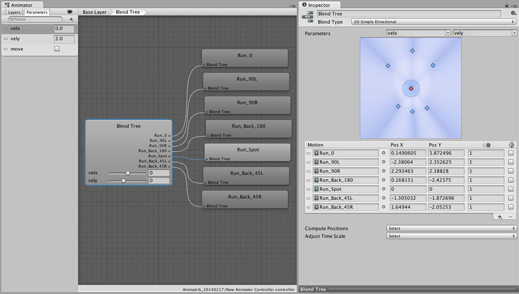
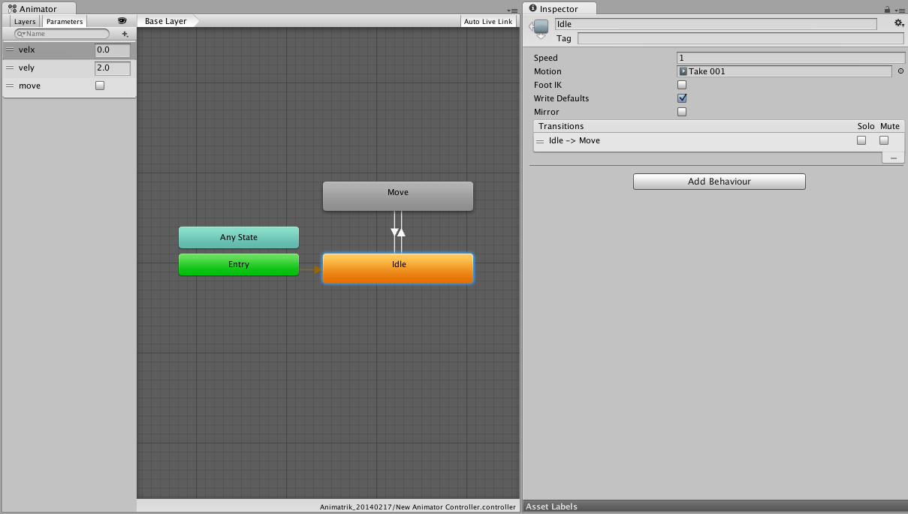
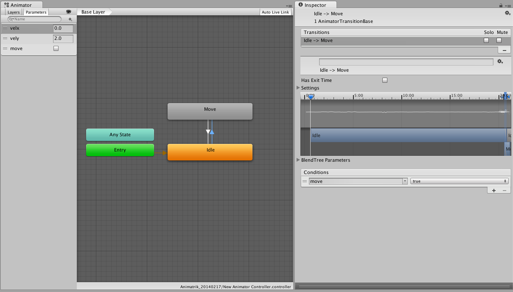

# Couple Animation and Navigation

The goal of this document is to guide you to setup navigating humanoid characters to move using the navigation system.

We’ll be using Unity’s built-in systems for animation and navigation along with custom scripting to achieve this.

It’s assumed you’re familiar with the basics of Unity and the Mecanim animation system.

An example project is available — so you don’t have to add [**scripts**][1] or set up animations and animation controller from scratch:

- [NavigationAnimation\_53.zip](https://docs.unity3d.com/2021.3/Documentation/uploads/Examples/NavigationAnimation_53.zip) _Works with Unity 5.3+_

## Creating the Animation Controller

To get a responsive and versatile animation controller — covering a wide range of movements — we need a set of animations moving in different directions. This is sometimes referred to as a strafe-set.

In addition to the move animations we need an animation for the standing character.

We proceed by arranging the strafe-set in a 2D blend tree — choose blend type: **2D Simple Directional** and place animations using **Compute Positions > Velocity XZ**

For blending control we add two float parameters **velx** and **vely**, and assign them to the blend tree.

Here we’ll be placing 7 run animations — each with a different velocity. In addition to the forwards (+ left/right) and backwards (+ left/right) we also use an [**animation clip**][2] for running on the spot. The latter is highlighted in the center of the 2D blend map below. The reason for having an animation running on the spot is two-fold, firstly it preserves the style of running when blended with the other animations. Secondly the animation prevents foot-sliding when blending.



Then we add the idle animation clip in it’s own node (**Idle**). We now have two discrete animation states that we couple with 2 transitions.



To control the switch between the moving and idle states we add a boolean control parameter **move**. Then disable the **Has Exit Time** property on the transitions. This allows the transition to trigger at any time during the animation. Transition time should be set to around 0.10 second to get a responsive transition.



Now place the new created animation controller on the character you want to move.

Press play and select the character in the **Hierarchy window**. You can now manually control the animation values in the [**Animator window**][3] and change the move state and velocity.

The next step is to create other means of controlling the [**animation parameters**][4].

## Navigation Control

Place a **NavMeshAgent** component on the character and adjust the radius, height and to match the character - additionally change the speed property to match the maximum speed in the [**animation blend tree**][5].

Create a [**NavMesh**][5] for the [**Scene**][6] you’ve placed the character in.

Next we need to tell the character where to navigate to. This typically is very specific to the application. Here we choose a click to move behavior — the character moved to the point in the world where the user has clicked on the screen.

``` C#
// ClickToMove.cs
using UnityEngine;
using UnityEngine.AI;

[RequireComponent (typeof (NavMeshAgent))]
public class ClickToMove : MonoBehaviour {
    RaycastHit hitInfo = new RaycastHit();
    NavMeshAgent agent;

    void Start () {
        agent = GetComponent<NavMeshAgent> ();
    }
    void Update () {
        if(Input.GetMouseButtonDown(0)) {
            Ray ray = Camera.main.ScreenPointToRay(Input.mousePosition);
            if (Physics.Raycast(ray.origin, ray.direction, out hitInfo))
                agent.destination = hitInfo.point;
        }
    }
}
```

Pressing play now — and clicking around in the scene — you’ll see the character move around in the scene. However — the animations don’t match the movement at all. We need to communicate the state and velocity of the agent to the animation controller.

To transfer the velocity and state info from the agent to the animation controller we will add another script.

``` C#
// LocomotionSimpleAgent.cs
using UnityEngine;
using UnityEngine.AI;

[RequireComponent (typeof (NavMeshAgent))]
[RequireComponent (typeof (Animator))]
public class LocomotionSimpleAgent : MonoBehaviour {
    Animator anim;
    NavMeshAgent agent;
    Vector2 smoothDeltaPosition = Vector2.zero;
    Vector2 velocity = Vector2.zero;

    void Start ()
    {
        anim = GetComponent<Animator> ();
        agent = GetComponent<NavMeshAgent> ();
        // Don’t update position automatically
        agent.updatePosition = false;
    }
    
    void Update ()
    {
        Vector3 worldDeltaPosition = agent.nextPosition - transform.position;

        // Map 'worldDeltaPosition' to local space
        float dx = Vector3.Dot (transform.right, worldDeltaPosition);
        float dy = Vector3.Dot (transform.forward, worldDeltaPosition);
        Vector2 deltaPosition = new Vector2 (dx, dy);

        // Low-pass filter the deltaMove
        float smooth = Mathf.Min(1.0f, Time.deltaTime/0.15f);
        smoothDeltaPosition = Vector2.Lerp (smoothDeltaPosition, deltaPosition, smooth);

        // Update velocity if time advances
        if (Time.deltaTime > 1e-5f)
            velocity = smoothDeltaPosition / Time.deltaTime;

        bool shouldMove = velocity.magnitude > 0.5f && agent.remainingDistance > agent.radius;

        // Update animation parameters
        anim.SetBool("move", shouldMove);
        anim.SetFloat ("velx", velocity.x);
        anim.SetFloat ("vely", velocity.y);

        GetComponent<LookAt>().lookAtTargetPosition = agent.steeringTarget + transform.forward;
    }

    void OnAnimatorMove ()
    {
        // Update position to agent position
        transform.position = agent.nextPosition;
    }
}
```

This script deserves a little explanation. It’s placed on the character — which has an **Animator** and a **NavMeshAgent** component attached — as well as the click to move script above.

First the script tells the agent not to update the character position automatically. We handle the position update that last in the script. The orientation is updated by the agent.

The animation blend is controlled by reading the agent velocity. It is transformed into a relative velocity (based on character orientation) — and then smoothed. The transformed horizontal velocity components are then passed to the **Animator** and additionally the state switching between idle and moving is controlled by the speed (i.e. velocity magnitude).

In the `OnAnimatorMove()` callback we update the position of the character to match the **NavMeshAgent**.

Playing the scene again gives show that animation matches the movement to as close as possible.

## Improving the Quality of the Navigating Character

To improve the quality of the animated and navigating character we will explore a couple of options.

### Looking

Having the character to look and turn towards points of interest is important to convey attention and anticipation. We’ll use the animation systems `LookAt` API. This calls for another script.

``` C#
// LookAt.cs
using UnityEngine;
using System.Collections;

[RequireComponent (typeof (Animator))]
public class LookAt : MonoBehaviour {
    public Transform head = null;
    public Vector3 lookAtTargetPosition;
    public float lookAtCoolTime = 0.2f;
    public float lookAtHeatTime = 0.2f;
    public bool looking = true;

    private Vector3 lookAtPosition;
    private Animator animator;
    private float lookAtWeight = 0.0f;

    void Start ()
    {
        if (!head)
        {
            Debug.LogError("No head transform - LookAt disabled");
            enabled = false;
            return;
        }
        animator = GetComponent<Animator> ();
        lookAtTargetPosition = head.position + transform.forward;
        lookAtPosition = lookAtTargetPosition;
    }

    void OnAnimatorIK ()
    {
        lookAtTargetPosition.y = head.position.y;
        float lookAtTargetWeight = looking ? 1.0f : 0.0f;

        Vector3 curDir = lookAtPosition - head.position;
        Vector3 futDir = lookAtTargetPosition - head.position;

        curDir = Vector3.RotateTowards(curDir, futDir, 6.28f * Time.deltaTime, float.PositiveInfinity);
        lookAtPosition = head.position + curDir;

        float blendTime = lookAtTargetWeight > lookAtWeight ? lookAtHeatTime : lookAtCoolTime;
        lookAtWeight = Mathf.MoveTowards (lookAtWeight, lookAtTargetWeight, Time.deltaTime / blendTime);
        animator.SetLookAtWeight (lookAtWeight, 0.2f, 0.5f, 0.7f, 0.5f);
        animator.SetLookAtPosition (lookAtPosition);
    }
}
```

Add the script to the character and assign the head property to the head transform in your characters transform hierarchy. The LookAt script has no notion of navigation control — so to control where to look we go back to the **LocomotionSimpleAgent.cs** script and add a couple of lines to control the looking. Add the end of `Update()` add:

``` C#
        LookAt lookAt = GetComponent<LookAt> ();
        if (lookAt)
            lookAt.lookAtTargetPosition = agent.steeringTarget + transform.forward;
```

This will tell the **LookAt** script to set the point of interest to approximately the next corner along the path or — if no corners — to the end of the path.

Try it out.

### Animation Driven Character using Navigation

The character has so far been controlled completely by the position dictated by the agent. This ensures that the avoidance of other characters and obstacles translates directly to the character position. However it may lead to foot-sliding if the animation doesn’t cover the proposed velocity. Here we’ll relax the constraint of the character a bit. Basically we’ll be trading the avoidance quality for animation quality.

Replace the `OnAnimatorMove()` callback on the **LocomotionSimpleAgent.cs** script replace the line with the following

``` C#
    void OnAnimatorMove ()
    {
        // Update position based on animation movement using navigation surface height
        Vector3 position = anim.rootPosition;
        position.y = agent.nextPosition.y;
        transform.position = position;
    }
```

When trying this out you may notice the that character can now drift away from the agent position (green wireframe cylinder) . You may need to limit that character animation drift. This can be done either by pulling the agent towards the character — or pull the character towards the agent position. Add the following at the end of the `Update()` method on the script **LocomotionSimpleAgent.cs**.

``` C#
        // Pull character towards agent
        if (worldDeltaPosition.magnitude > agent.radius)
            transform.position = agent.nextPosition - 0.9f * worldDeltaPosition;
```

Or — if you want the agent to follow the character.

``` C#
        // Pull agent towards character
        if (worldDeltaPosition.magnitude > agent.radius)
            agent.nextPosition = transform.position + 0.9f * worldDeltaPosition;
```

What works best very much depends on the specific use-case.

## Conclusion

We have set up a character that moves using the navigation system and animates accordingly. Tweaking the numbers of blend time, look-at weights etc. can improve the looks — and is a good way to further explore this setup.

[1]: ./Glossary.md#scripts "A piece of code that allows you to create your own Components, trigger game events, modify Component properties over time and respond to user input in any way you like."

[2]: ./Glossary.md#animation-clip 'Animation data that can be used for animated characters or simple animations. It is a simple “unit” piece of motion, such as (one specific instance of) “Idle”, “Walk” or “Run”.'

[3]: ./Glossary.md#animator-window "The window where the Animator Controller is visualized and edited."

[4]: ./Glossary.md#animation-parameters "Used to communicate between scripting and the Animator Controller. Some parameters can be set in scripting and used by the controller, while other parameters are based on Custom Curves in Animation Clips and can be sampled using the scripting API."

[5]: ./Glossary.md#navmesh "A mesh that Unity generates to approximate the walkable areas and obstacles in your environment for path finding and AI-controlled navigation."

[6]: ./Glossary.md#scene "A Scene contains the environments and menus of your game. Think of each unique Scene file as a unique level. In each Scene, you place your environments, obstacles, and decorations, essentially designing and building your game in pieces."
