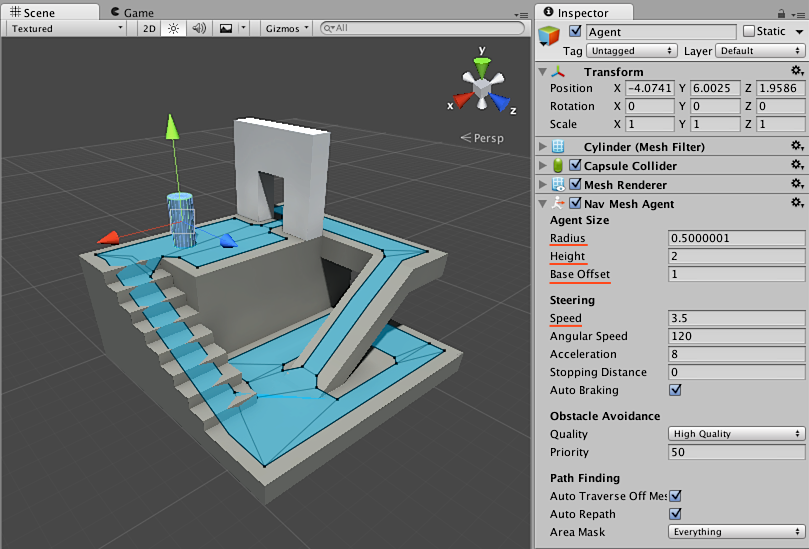

# Create a NavMesh Agent

Once you have a [**NavMesh**][1] baked for your level it is time to create a character which can navigate the [**Scene**][2]. We’re going to build our prototype agent from a cylinder and set it in motion. This is done using a NavMesh Agent component and a simple script.



First let’s create the character:

1. Create a **cylinder**: **GameObject > 3D Object > Cylinder**.
2. The default cylinder dimensions (height 2 and radius 0.5) are good for a humanoid shaped agent, so we will leave them as they are.
3. Add a **NavMesh Agent** component: **Component > Navigation > NavMesh Agent**.

Now you have simple NavMesh Agent set up ready to receive commands!

When you start to experiment with a NavMesh Agent, you most likely are going to adjust its dimensions for your character size and speed.

The **NavMesh Agent** component handles both the pathfinding and the movement control of a character. In your [**scripts**][3], navigation can be as simple as setting the desired destination point - the NavMesh Agent can handle everything from there on.

``` C#
    // MoveTo.cs
    using UnityEngine;
    using UnityEngine.AI;
    
    public class MoveTo : MonoBehaviour {
       
       public Transform goal;
       
       void Start () {
          NavMeshAgent agent = GetComponent<NavMeshAgent>();
          agent.destination = goal.position; 
       }
    }
```

Next we need to build a simple script which allows you to send your character to the destination specified by another Game Object, and a Sphere which will be the destination to move to:

1. Create a new **C# script** (`MoveTo.cs`) and replace its contents with the above script.
2. Assign the MoveTo script to the character you’ve just created.
3. Create a **sphere**, this will be the destination the agent will move to.
4. Move the sphere away from the character to a location that is close to the NavMesh surface.
5. Select the character, locate the MoveTo script, and assign the Sphere to the **Goal** property.
6. **Press Play**; you should see the agent navigating to the location of the sphere.

To sum it up, in your script, you will need to get a reference to the NavMesh Agent component and then to set the agent in motion, you just need to assign a position to its [destination][4] property. The [Navigation How Tos](./NavHowTos.md) will give you further examples on how to solve common gameplay scenarios with the NavMesh Agent.

## Additional resources

- [Create a NavMesh](./CreateNavMesh.md)
- [Navigation HowTos](./NavHowTos.md "Common use cases for NavMesh Agent, with source code.")
- [Inner Workings of the Navigation System](./NavInnerWorkings.md#following-the-path "Learn more about path following.")
- [Navigation agent configurations](./NavigationWindow.md#agents-tab "Guidance on how to define classes of agents with different attributes.")
- [NavMesh Agent component reference](./NavMeshAgent.md "Full description of all the NavMeshAgent properties.")
- [NavMesh Agent scripting reference](https://docs.unity3d.com/6000.0/Documentation/ScriptReference/AI.NavMeshAgent.html "Full description of the NavMeshAgent scripting API.")

[1]: ./Glossary.md#NavMesh "A mesh that Unity generates to approximate the walkable areas and obstacles in your environment for path finding and AI-controlled navigation."

[2]: ./Glossary.md#scene "A Scene contains the environments and menus of your game. Think of each unique Scene file as a unique level. In each Scene, you place your environments, obstacles, and decorations, essentially designing and building your game in pieces."

[3]: ./Glossary.md#scripts "A piece of code that allows you to create your own Components, trigger game events, modify Component properties over time and respond to user input in any way you like." 

[4]: https://docs.unity3d.com/6000.0/Documentation/ScriptReference/AI.NavMeshAgent-destination.html "Script reference for the NavMeshAgent destination property."
