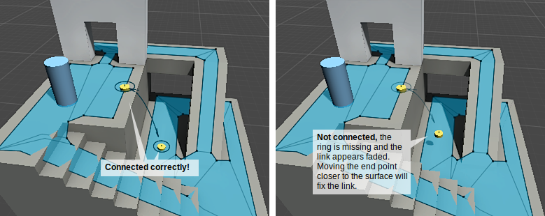

# Creating a NavMesh Link

NavMesh Links are used to create paths crossing outside the walkable [**navigation mesh**][2] surface. For example, jumping over a ditch or a fence, or opening a door before walking through it, can be all described as NavMesh links.

You can define the start and end points of the link by placing two game objects in the [**Scene**][3] and adding a NavMesh Link component to one of them. The NavMesh Link will then create a navigation connection that the [**NavMesh Agent**](./NavMeshAgent.md) can follow.

We’re going to add an NavMesh Link component to describe a jump from the upper platform to the ground.

1. First create **two cylinders**: **Game Object > 3D Object > cylinder**.
2. You can scale the cylinders to _(0.1, 0.5, 0.1)_ to make it easier to work with them.
3. Move the **first cylinder** to the edge of the top platform, close to the [**NavMesh**][2] surface.
4. Place the **second cylinder** on the ground, close to the NavMesh, at the location where the link should land.
5. Select the **first cylinder** and add an NavMesh Link component to it. Choose **Add Component** from the inspector and choose **Navigation > NavMesh Link**.
6. Assign the **first cylinder** in the **Start Transform** field and the **second cylinder** in the **End Transform** field.

Now you have a functioning NavMesh Link set up! Pathfinding will return the path going through the NavMesh link if that path is shorter than via walking along the NavMesh.

You can use any game object in the [**Scene**][3] to hold the NavMesh link component, for example a fence [**prefab**][4] could contain the NavMesh link component. Similarly you can use any game object with a Transform as the start and end marker.

The NavMesh bake process can detect and create common jump-across and drop-down links automatically. Take a look at the settings of [NavMesh Surface](./NavMeshSurface.md) for more details.

## How to troubleshoot a link that does not work

If the agent does not traverse a NavMesh Link make sure that both end points are connected correctly to the NavMesh. To check the state of the connection make sure to enable the **Show NavMesh** debug visualization in the [AI Navigation overlay](./NavigationOverlay.md). When the link has no width, a properly connected end point shows a circle around the access point in the scene view. If the link has width, the link shows a dark segment on the edge that connects properly to the NavMesh, or a gray line if the edge does not connect to the NavMesh. If both ends connect to the NavMesh, the wide link shows an additional solid transparent rectangle that fills the space between the link edges. The NavMesh link also shows an arc line between the ends, with an arrow at each end where the agent can exit the link. The arc line is colored black if at least one end is connected, or it is colored gray if none of the ends is connected to the NavMesh.

No agent or path can traverse a link that has the **Activated** property disabled. In that situation the link shows in the scene with a red color. Make sure to enable the **Activated** property when you want agents to be able to move through the link.

Another common cause of why an agent does not traverse a NavMesh Link is that the NavMesh Agent’s _Area Mask_ does not include the NavMesh Link’s area type.

### Additional resources

- [NavMesh Link component reference](./NavMeshLink.md)
- [Navigation HowTos](./NavHowTos.md) - common use cases for NavMesh Agent, with source code.
- [Sample 7 - Dungeon](./Samples.md) – an example of NavMesh links connecting NavMeshes at runtime.
- [NavMesh Link scripting reference](../api/Unity.AI.Navigation.NavMeshLink.html) - full description of the NavMesh Link scripting API.

[2]: ./Glossary.md#navmesh "A mesh that Unity generates to approximate the walkable areas and obstacles in your environment for path finding and AI-controlled navigation."
[3]: https://docs.unity3d.com/Manual/CreatingScenes.html "A Scene contains the environments and menus of your game. Think of each unique Scene file as a unique level. In each Scene, you place your environments, obstacles, and decorations, essentially designing and building your game in pieces."
[4]: https://docs.unity3d.com/Manual/Prefabs.html "An asset type that allows you to store a GameObject complete with components and properties. The prefab acts as a template from which you can create new object instances in the scene."
