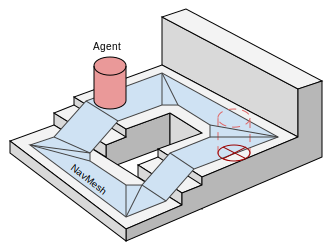
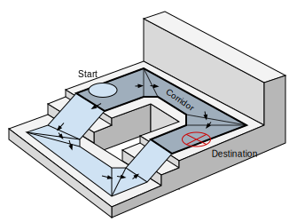
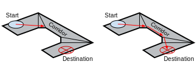
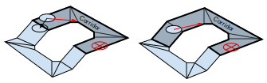
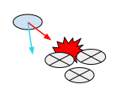
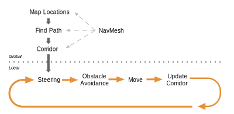
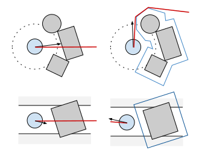
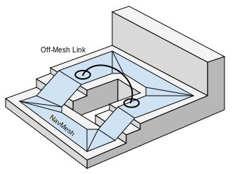

# Inner Workings of the Navigation System

When you want to intelligently move characters in your game (or agents as they are called in AI circles), you have to solve two problems: how to reason about the level to find the destination, then how to move there. These two problems are tightly coupled, but quite different in nature. The problem of reasoning about the level is more global and static, in that it takes into account the whole [**Scene**][1]. Moving to the destination is more local and dynamic, it only considers the direction to move and how to prevent [collisions][2] with other moving agents.

## Walkable Areas

The navigation system needs its own data to represent the walkable areas in a game scene. The walkable areas define the places in the scene where the agent can stand and move. In Unity the agents are described as cylinders. The walkable area is built automatically from the geometry in the scene by testing the locations where the agent can stand. Then the locations are connected to a surface laying on top of the scene geometry. This surface is called the navigation [mesh][3] (NavMesh for short).

The [NavMesh][4] stores this surface as convex polygons. Convex polygons are a useful representation, since we know that there are no obstructions between any two points inside a polygon. In addition to the polygon boundaries, we store information about which polygons are neighbors to each other. This allows us to reason about the whole walkable area.

## Finding Paths

To find a path between two locations in the scene, we first need to map the start and destination locations to their nearest polygons. Then we start searching from the start location, visiting all the neighbors until we reach the destination polygon. Tracing the visited polygons allows us to find the sequence of polygons which will lead from the start to the destination. A common algorithm to find the path is A\* (pronounced “A star”), which is what Unity uses.

## Following the Path

The sequence of polygons which describe the path from the start to the destination polygon is called a corridor. The agent will reach the destination by always steering towards the next visible corner of the corridor. If you have a simple game where only one agent moves in the scene, it is fine to find all the corners of the corridor in one swoop and animate the character to move along the line segments connecting the corners.

When dealing with multiple agents moving at the same time, they will need to deviate from the original path when avoiding each other. Trying to correct such deviations using a path consisting of line segments soon becomes very difficult and error prone.

Since the agent movement in each frame is quite small, we can use the connectivity of the polygons to fix up the corridor in case we need to take a little detour. Then we quickly find the next visible corner to steer towards.

## Avoiding Obstacles

The steering logic takes the position of the next corner and based on that figures out a desired direction and speed (or velocity) needed to reach the destination. Using the desired velocity to move the agent can lead to collision with other agents.

Obstacle avoidance chooses a new velocity which balances between moving in the desired direction and preventing future collisions with other agents and edges of the navigation mesh. Unity is using reciprocal velocity obstacles (RVO) to predict and prevent collisions.

## Moving the Agent

Finally after steering and obstacle avoidance the final velocity is calculated. In Unity the agents are simulated using a simple dynamic model, which also takes into account acceleration to allow more natural and smooth movement.

At this stage you can feed the velocity from the simulated agent to the animation system to move the character using [root motion][5], or let the navigation system take care of that.

Once the agent has been moved using either method, the simulated agent location is moved and constrained to NavMesh. This last small step is important for robust navigation.

## Global and Local

One of the most important things to understand about navigation is the difference between global and local navigation.

Global navigation is used to find the corridor across the world. Finding a path across the world is a costly operation requiring quite a lot of processing power and memory.

The linear list of polygons describing the path is a flexible data structure for steering, and it can be locally adjusted as the agent’s position moves. Local navigation tries to figure out how to efficiently move towards the next corner without colliding with other agents or moving objects.

## Two Cases for Obstacles

Many applications of navigation require other types of obstacles rather than just other agents. These could be the usual crates and barrels in a shooter game, or vehicles. The obstacles can be handled using local obstacle avoidance or global pathfinding.

When an obstacle is moving, it is best handled using local obstacles avoidance. This way the agent can predictively avoid the obstacle. When the obstacle becomes stationary, and can be considered to block the path of all agents, the obstacles should affect the global navigation, that is, the navigation mesh.

Changing the NavMesh is called carving. The process detects which parts of the obstacle touches the NavMesh and carves holes into the NavMesh. This is a computationally expensive operation, which is yet another compelling reason, why moving obstacles should be handled using collision avoidance.

You can use local collision avoidance to steer around sparsely scattered obstacles too. Since the algorithm is local, it only considers the next immediate collisions, and cannot steer around traps or handle cases where an obstacle blocks a path. Use carving to solve these cases.

## About shortcuts between positions on NavMeshes

The connections between the NavMesh polygons are described using links inside the pathfinding system. Sometimes it is necessary to let the agent navigate across places which are not walkable, for example, jumping over a fence, or traversing through a closed door. These cases need to know the location of the action.

You can annotate these actions with the **NavMesh Link** component, which tells the pathfinder that a route exists through the specified link. Your code can later access this link and perform the special action as the agent follows the path.

## About Voxels

The NavMesh bake process uses voxelization to build the NavMesh from arbitrary level geometry. The algorithm first [rasterizes](./Glossary.md#rasterization) the scene into voxels, then it extracts the walkable surfaces, then finally, turns the walkable surfaces into a navigation mesh. Voxels are the cells in a regular 3D grid where the scene geometry overlaps with that grid. The grid cells have a width and a length of [**Voxel Size**](./NavMeshSurface.md#advanced-settings) and a height that is half of that width.

To increase the accuracy of the resulting NavMesh shape, reduce the **Voxel Size** so that the 3D grid can rasterize finer details from the scene geometry. The time it takes to process the scene geometry is proportional to the number of voxels that the geometry occupies. When the NavMesh Surface uses a small voxel size, it generally creates the NavMesh more slowly than when it uses a larger voxel size. If you want to create the NavMesh faster, and you can no longer reduce the number of [scene objects](./NavMeshSurface.md#object-collection) to process, you can increase the voxel size. With that modification, the resulting NavMesh matches the scene geometry with lower accuracy, both at the edges around obstacles and in the elevation relative to the ground.

To extend the NavMesh Surface through narrow passages, such as doors, and to maintain a quick baking time, choose the voxel size such that 3 voxels fit one Agent radius (6 per diameter). The **NavMesh Surface** uses this size by default. For big open areas, using 1 or 2 voxels per radius speeds up baking. Tight indoor spots are better suited to smaller voxels, for example 4 to 6 voxels per radius. More than 8 voxels per radius does not usually provide much additional benefit.

[1]: ./Glossary.md#scene "A Scene contains the environments and menus of your game. Think of each unique Scene file as a unique level. In each Scene, you place your environments, obstacles, and decorations, essentially designing and building your game in pieces."

[2]: ./Glossary.md#collision "A collision occurs when the physics engine detects that the colliders of two GameObjects make contact or overlap, when at least one has a Rigidbody component and is in motion."

[3]: ./Glossary.md#mesh "The main graphics primitive of Unity. Meshes make up a large part of your 3D worlds. Unity supports triangulated or Quadrangulated polygon meshes. Nurbs, Nurms, Subdiv surfaces must be converted to polygons."

[4]: ./Glossary.md#navmesh "A mesh that Unity generates to approximate the walkable areas and obstacles in your environment for path finding and AI-controlled navigation."

[5]: ./Glossary.md#root-motion "Motion of character’s root node, whether it’s controlled by the animation itself or externally."
