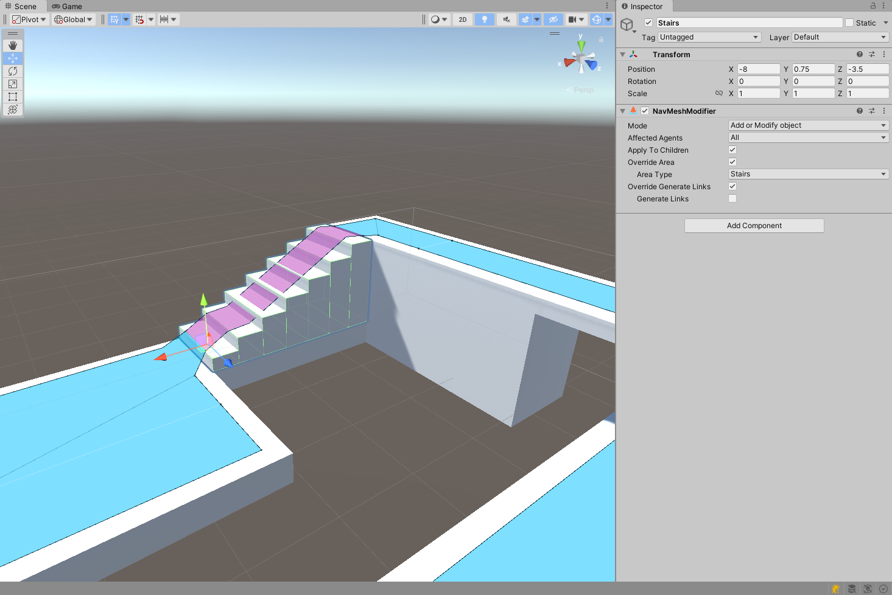

# NavMeshModifier

NavMesh Modifiers adjust how a specific GameObject behaves during NavMesh baking at runtime.

To use the NavMesh Modifier component, navigate to __GameObject__ > __AI__ > __NavMesh Modifier__.

In the image below, the platform in the bottom right has a modifier attached to it that sets its __Area Type__ to __Lava__.

The NavMesh Modifier affects GameObjects hierarchically, meaning the GameObject that the component is attached to as well as all its children are affected. Additionally, if another NavMesh Modifier is found further down the transform hierarchy, the new NavMesh Modifier overrides the one further up the hierarchy.

The NavMesh Modifier also affects the NavMesh generation process, meaning the NavMesh has to be updated to reflect any changes to NavMesh Modifiers.

--

Note: This component is a replacement for the legacy setting which could be enabled from the Navigation window Objects tab as well as the static flags dropdown on the GameObject. This component is available for baking at runtime, whereas the static flags are available in the editor only.

## Parameters
|**Property:** |**Function:** |
|:---|:---|
| __Ignore From Build__| Check this tickbox to exclude the GameObject and all if its children from the build process. |
| __Override Area Type__| Check this tickbox to change the area type for the GameObject containing the Modifier and all of its children. |
| __Area Type__| Select the new area type to apply from the drop-down menu. |
| __Affected Agents__| A selection of Agents the Modifier affects. For example, you may choose to exclude certain obstacles from specific Agents.  |

